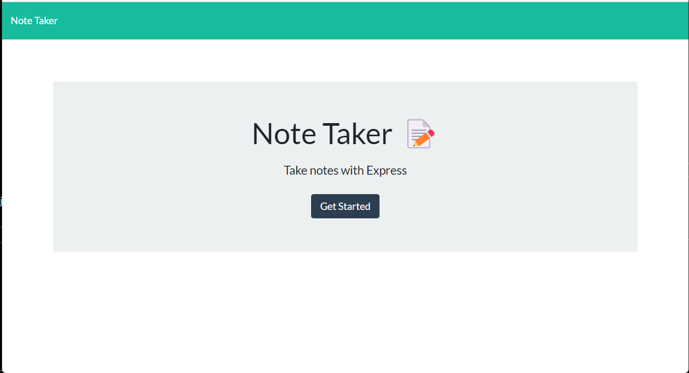
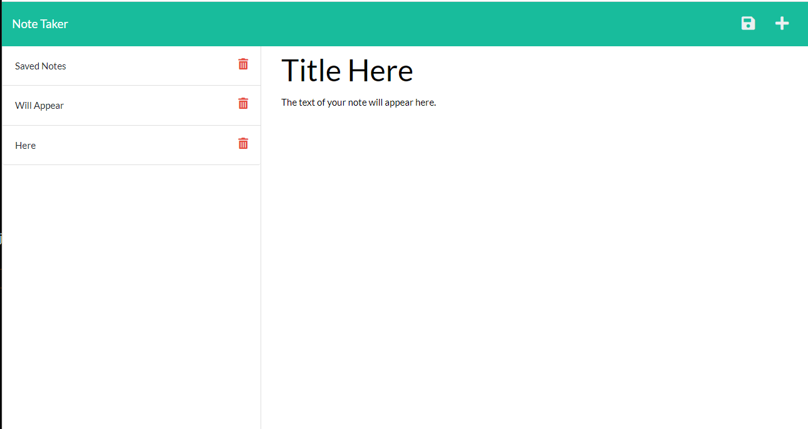

# note_taker
An application that allows the user to write notes as well as organize tasks and appointments. 

## Live Deployed Application
- [Live app](https://enigmatic-cove-03555.herokuapp.com/notes)
## Developer Info  
- developed by Karl Linfeldt  

- [Github](https://github.com/KarlOL82/note_taker)  
- [email](klinfeldt@gmail.com)  

## User Story

AS A small business owner
I WANT to be able to write and save notes
SO THAT I can organize my thoughts and keep track of tasks I need to complete  

## Overview  
This application was created in Node JS with Express 4.17.1. It is powered by Javascript, HTML, and CSS and deployed via Heroku. The application was created as the Module 11 challenge assignment for the University of Washington Coding Bootcamp.  
-Dependencies: Express ^4.17.1  

## Usage
Navigate to the landing page using the provided URL and then click on the 'Get Started' link. You can then make a note by entering a title and text in the indicated fields. The save icon in the top right corner of the windown will save the note and display it in the left-hand column. The notes in the saved column can be viewed in the main note area by clicking on them or erased by clicking the red delete icon.  

## License
    
  https://opensource.org/licenses/MIT
  
  ## MIT
   
 "This application is using license MIT."

 ## Photos  
   
 

